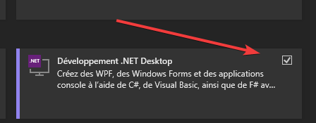
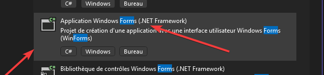
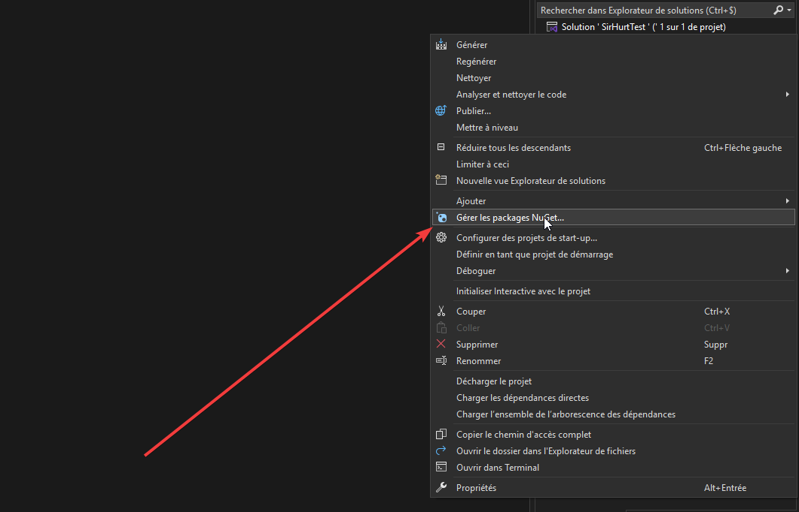
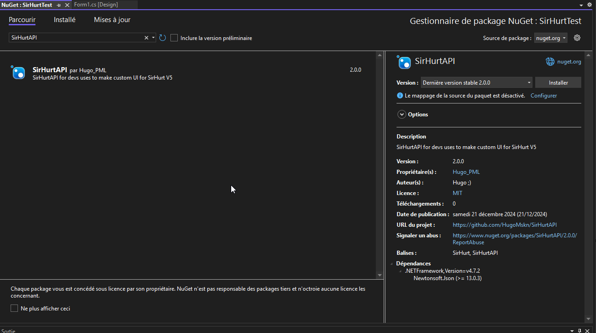
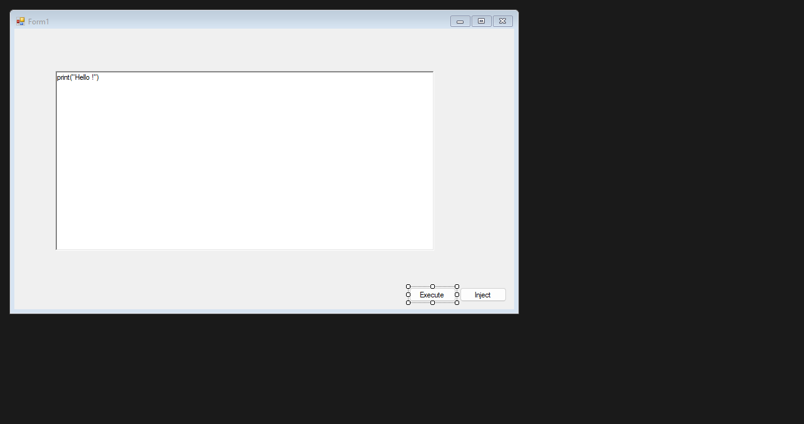
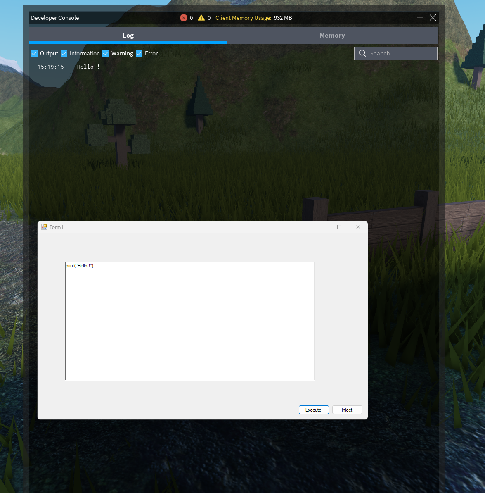

# SirHurt API

Let's cook a basic gui **in less than 5 minutes**.


### What you'll need

- [Visual Studio](https://visualstudio.microsoft.com) :
  - When installing Visual studio, make sure to select C# desktop apps !.
  

## Creating the project

Create a new **C# Form**, make sure to pick .net framework !


The project will automatically be created and opened


## Install SirHurt API

Right click on the project and select "Manage NuGet packages"



Search "SirHurt API" and pick the latest version


You can then add controls for the API



Double click on a button to open it in the code editor
At the top of the file you will need to import the api

```c# title="Form1.cs"
using SirHurtAPI;
```

Then pick the method for your inject method and add this code to inject SirHurt

```c# title="Form1.cs"
SirHurtAPI.SirHurtAPI.LaunchExploit();
```

Add this line to make the api automatically download all SirHurt files

```c# title="Form1.cs"
public Form1()
{
    InitializeComponent();
    if (!SirHurtAPI.SirHurtAPI.BoostrapSirHurt())
    {
        MessageBox.Show("Failed to boostrap SirHurt API");
        Environment.Exit(0);
    }
}
```

Double click on the method for the inject button and add this line 

```c# title="Form1.cs"
SirHurtAPI.SirHurtAPI.Execute(CodeBox.Text,false); // The false line is if you want to Force clear the script queue
                              //^
                              //Replace with the name of your textbox/ richt text box
```


Then you can hit the debug button and start Roblox


## Results

Congrats ! You just made a SirHurt GUI !
